<div align="center">
  
</div>

<div align="center">
  
</div>

<div align="center">
  
  
  
  <br/>
  
  
</div>

---

## 🎯 Quick Overview


```javascript
const tanmay = {
    pronouns: "He" | "Him",
    code: ["JavaScript", "TypeScript", "Python", "Java", "Dart"],
    askMeAbout: ["web dev", "mobile dev", "cloud", "AI/ML"],
    technologies: {
        frontEnd: {
            js: ["React", "Next.js", "Angular"],
            css: ["Tailwind", "Bootstrap", "Styled Components"]
        },
        backEnd: {
            js: ["Node.js", "Express", "NestJS"],
            python: ["Flask", "FastAPI"]
        },
        mobile: ["React Native", "Expo"],
        databases: ["MongoDB", "PostgreSQL", "MySQL"],
        cloud: ["AWS", "Firebase", "Vercel"],
        devOps: ["Docker", "GitHub Actions", "Jenkins"]
    },
    currentFocus: "Building AI-powered applications 🤖",
    funFact: "I debug with console.log and I'm not ashamed! 😄"
};
```

<br clear="both">

---

## 🛠️ Tech Stack & Tools

<div align="center">

### 🚀 Languages


### 🎨 Frontend


### ⚡ Backend & Database


### ☁️ Cloud & DevOps


</div>

---

## 📊 GitHub Statistics

<div align="center">
  
  
</div>

<div align="center">
  
</div>

<div align="center">
  
</div>

---

## 🏆 GitHub Trophies

<div align="center">
  
</div>

---

## 🎯 Current Focus

```mermaid
mindmap
  root((Tanmay))
    🤖 AI/ML
      TensorFlow
      OpenAI APIs
      LangChain
    🚀 Web Development
      Next.js 14
      React Server Components
      Serverless Architecture
    📱 Mobile Development
      React Native
      Expo Router
      Native Modules
    ☁️ Cloud & DevOps
      AWS Services
      Docker Containers
      CI/CD Pipelines
```

<div align="center">



</div>

---

## 🌟 What I'm Up To

- 🔭 Currently working on **AI-powered applications** at IntellAxis AI
- 🌱 Learning **Advanced Cloud Architecture** and **Machine Learning**
- 👯 Looking to collaborate on **Open Source Projects**
- 💬 Ask me about **React**, **Node.js**, **React Native**, **Cloud Deployment**
- ⚡ Fun fact: **I started coding at 19 and haven't stopped since!**

---

## 🎵 Spotify Playing

<div align="center">
  
</div>

---

## 🤝 Let's Connect

<div align="center">

[](https://tanmayvaij.vercel.app)
[](https://linkedin.com/in/tanmayvaij)
[](https://instagram.com/tanmayvaij)
[](mailto:tanmayvaij22@gmail.com)

</div>

---

<div align="center">

### 💭 Random Dev Quote


</div>

---

<div align="center">

**🌟 Show some ❤️ by starring some of the repositories! 🌟**


</div>
